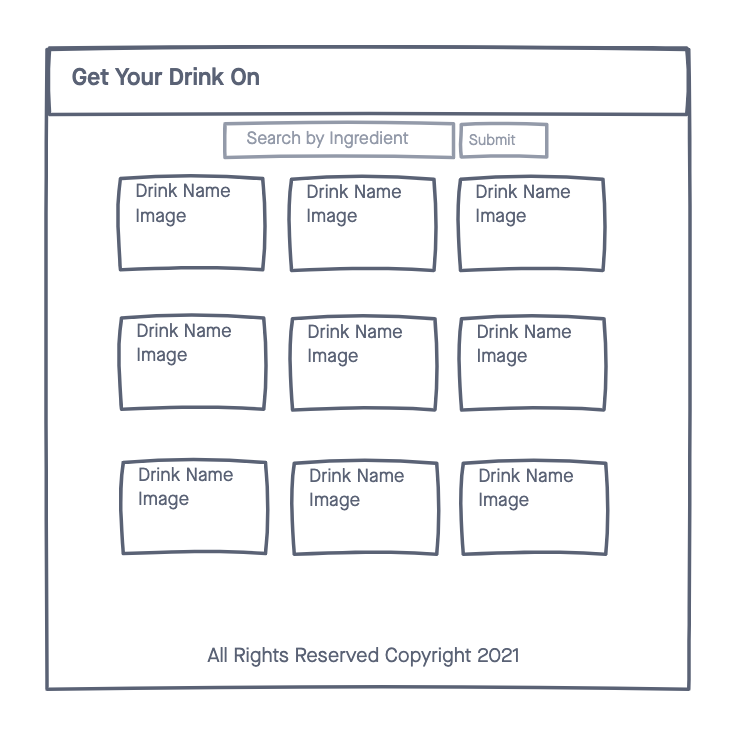
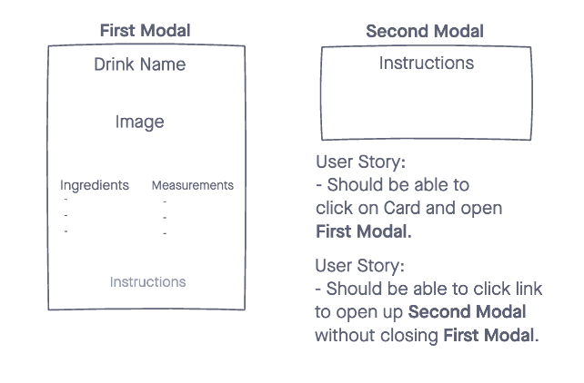

# Get Your Drink On
A simple web app that allows users to search Cocktail Database by ingredient. 

## Technologies
- HTML5
- CSS3
- JavaScript
- jQuery
- TheCocktailDB API

## Wireframes

## Getting Started
[Click here](https://nwilltell27.github.io/get-your-drink-on/) to get started.

## Future Enhancements
1. (COMPLETE) Clicking on **Cocktail Card** opens _Modal_ that displays ingredients/measurements. 
2. (COMPLETE) Create second _Modal_ that displays directions for making selected cocktail.
    - Or add directions under ingredients/measurements. 
3. (COMPLETE) Allow users to search by "Cocktail Name."