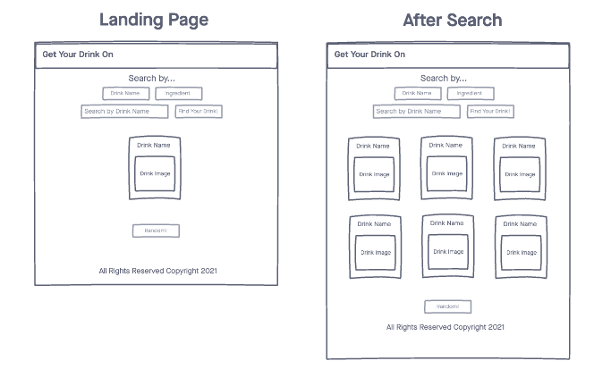

# Get Your Drink On
A simple web app that allows users to easily search Cocktail Database by name or ingredient. 

## Technologies
- HTML5
- CSS3
- JavaScript
- jQuery
- TheCocktailDB API

## Wireframes

## Screenshots
### Landing Page

### After Search (Drink Name or Ingredient)

### First Modal

### Second Modal

## Getting Started
[Click here to "Get Your Drink On."](https://nwilltell27.github.io/get-your-drink-on/) 

## Future Enhancements
1. (COMPLETE) Allow users to search by "Cocktail Name."
2. (COMPLETE) Clicking on **Cocktail Card** opens _Modal_ that displays ingredients/measurements. 
3. (COMPLETE) Create _2nd Modal_ that displays directions for making selected cocktail without closing _1st Modal_.
4. (COMPLETE) Initialize website to a _Random Cocktail_.
5. (COMPLETE) **Make "Mobile Friendly."**
6. (COMPLETE) Display number of results under search field. 
7. Convert all 1/2 measurements so they appear as a fraction. 